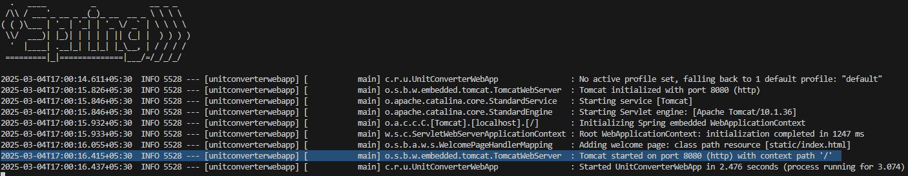

# [Ongoing] Todo List API

A RESTful API to allow users to manage their to-do list. The previous backend projects have only focused on the CRUD operations, but this project implements user authentication as well.

### Goals
- User authentication
- Schema design and Databases
- RESTful API design
- CRUD operations
- Error handling
- Security


### Technologies Used:
- **Backend:** Java, Springboot, MySQL, Spring Data JPA, Rest API, Authentication, Input Validation
- **Source Code Management:** Git, GitHub, Maven

### Installation
1. Clone the repo
```bash
    git git@github.com:avinashee0012/todo-list-api.git
    cd todo-list-api
```
2. Setup MySQL
    - [Install and Run MySQL](https://dev.mysql.com/doc/mysql-getting-started/en/)
    - Locate MySQL Port, Username and Password
    - Create a database for application

3. Run Jar
```bash
    # Default MySQL port is 3306
    # The default MySQL username is "root", and by default, it has no password on a fresh installation.
    java -jar todo-list-api-0.0.1.jar --spring.datasource.url=jdbc:mysql://localhost:<MySQL_PORT>/<DATABASE_NAME> --spring.datasource.username=<MYSQL_USERNAME> --spring.datasource.password=<MySQL_PASSWORD>
```
4. Visit http://localhost:8080/v1/api

NOTE: 
- If port 8080 is busy, another port will be used and can be found from terminal logs (see example below):


### Usage Example
- Endpoint 1: <code>/</code> --> GET (Get Server status)
- Endpoint 2: <code>/v1.0/api</code> --> GET (Get API status)
- Endpoint 3: <code>/v1.0/api/register</code> --> POST (Register User)
- Endpoint 4: <code>/v1.0/api/login</code> --> POST (Login User)
- Endpoint 5: <code>/v1.0/api/user/tasks</code> --> POST (Create Task)
- Endpoint 6: <code>/v1.0/api/user/tasks?page=1&limit=5</code> --> GET (Get all tasks created by logged-in user in paginated form)
- Endpoint 7: <code>/v1.0/api/user/tasks</code> --> GET (Get all tasks created by logged-in user in paginated form. With default values of page = 0, limit = 10)
- Endpoint 8: <code>/v1.0/api/user/tasks/{id}</code> --> GET (Get task by Id, if created by logged-in user)
- Endpoint 9: <code>/v1.0/api/user/tasks/{id}</code> --> PUT (Update task by Id, if created by logged-in user)
- Endpoint 10: <code>/v1.0/api/user/tasks/{id}</code> --> DELETE (Delete task by Id, if created by logged-in user)

_____

### Future releases
- Implement filtering and sorting for the to-do list
- Implement unit tests for the API
- Implement rate limiting and throttling for the API
- Implement refresh token mechanism for the authentication

####
Project Idea: [roadmap.sh](https://roadmap.sh/projects/todo-list-api)