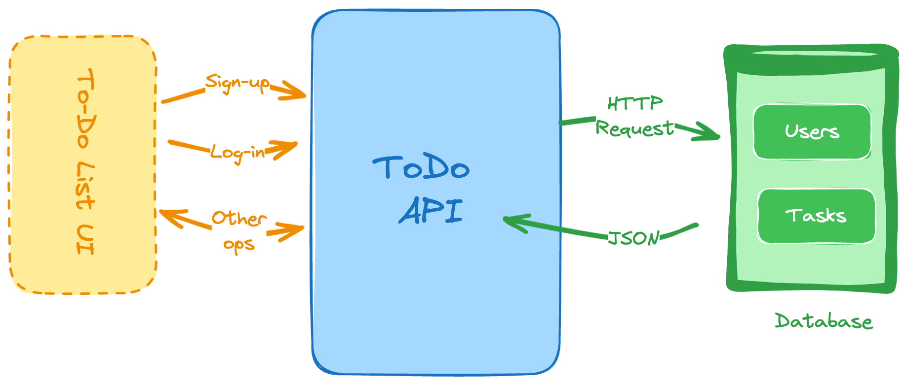

# [Ongoing] Todo List API

A RESTful API to allow users to manage their to-do list. The previous backend projects have only focused on the CRUD operations, but this project implements user authentication as well.

### Goals
- User authentication
- Schema design and Databases
- RESTful API design
- CRUD operations
- Error handling
- Security

### Technologies Used:
- **Backend:** Java, Springboot, MySQL, Spring Data JPA, Rest API, Authentication, Input Validation
- **Source Code Management:** Git, GitHub, Maven

### Installation

### Usage Example

_____

### Future releases
- Implement filtering and sorting for the to-do list
- Implement unit tests for the API
- Implement rate limiting and throttling for the API
- Implement refresh token mechanism for the authentication

####
Project Idea: [roadmap.sh](https://roadmap.sh/projects/todo-list-api)